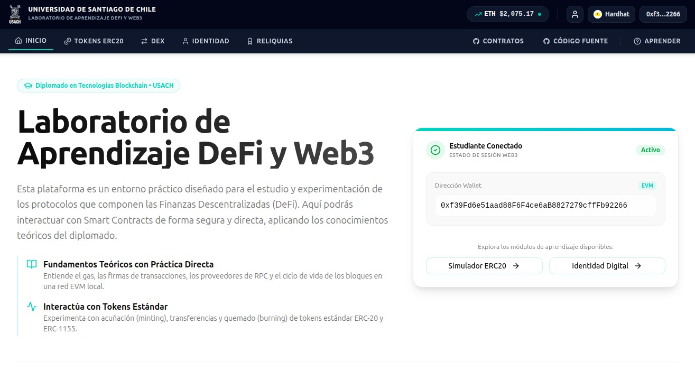
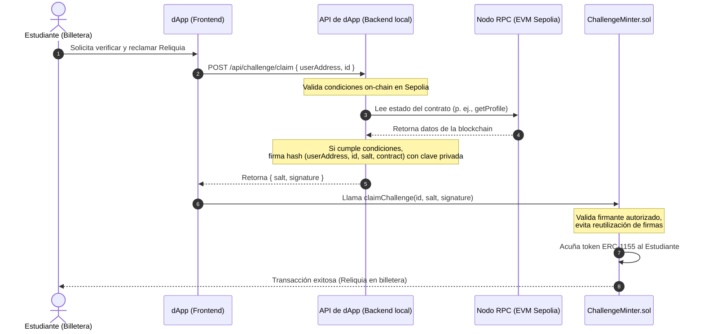

# USACH - dApp de Entrenamiento Web3



Este repositorio contiene la **Aplicación Descentralizada (dApp) de Entrenamiento** oficial para el **Diplomado en Tecnologías Blockchain** de la **Universidad de Santiago de Chile (USACH)**. 

La plataforma proporciona un entorno educativo interactivo e integral para que estudiantes y desarrolladores exploren el desarrollo de interfaces Web3, conecten billeteras criptográficas, interactúen con blockchains compatibles con EVM, simulen mercados financieros descentralizados y completen desafíos académicos con recompensas representadas como tokens no fungibles/semi-fungibles (NFTs) on-chain.

---

## 🚀 Características y Módulos de la Plataforma

La dApp cuenta con múltiples interfaces y sistemas dinámicos para guiar al estudiante de manera interactiva:

*   **Conexión de Billeteras Web3**: Integración fluida con [@rainbow-me/rainbowkit v2](https://rainbowkit.com) y [Wagmi v2](https://wagmi.sh) para interactuar de forma segura con billeteras (como MetaMask, Rainbow, Coinbase Wallet y WalletConnect) en redes locales o de pruebas (como Sepolia).
*   **Indicador de Precio de ETH en Tiempo Real**: Componente y hook reutilizable conectado a la API pública de Binance (`ETHUSDT`) con actualización automática cada 15 segundos y animaciones visuales de tendencias de precio (subida/bajada).
*   **Registro de Identidad Estudiantil**: Gestión y registro descentralizado del perfil académico a través del contrato inteligente `StudentIdentity.sol`, permitiendo vincular direcciones públicas (EOAs) con metadatos (nombre completo, correo institucional `@usach.cl`, perfil de GitHub y redes sociales).
*   **Simulador de Fábrica y Portal ERC-20**:
    *   **Despliegue Automatizado**: Creación descentralizada de tokens ERC-20 personalizados asignando nombre, símbolo y suministro mediante `TokenFactory.sol`.
    *   **Gestión de Balances y Acciones**: Panel interactivo para acuñar (`mint`) nuevas unidades (si se es el propietario), transferir saldo (`transfer`) a compañeros y ocultar automáticamente tokens sin balance positivo.
    *   **Historial de Transacciones**: Consulta interactiva de eventos de transferencia para auditoría on-chain en tiempo real.
*   **Intercambio Descentralizado (DEX)**:
    *   **Conversión de WETH (Wrapper)**: Interfaz de envoltura y desenvolvimiento de Ether nativo a ERC-20 atómico en paridad exactitud 1:1.
    *   **Fábrica de Pools**: Permite desplegar nuevas piscinas de intercambio (`DEXPool.sol`) para cualquier token personalizado emparejado con WETH mediante `DEXFactory.sol`.
    *   **AMM (Automated Market Maker)**: Provisión de liquidez simétrica (proporción 50/50), retiro de fondos quemando tokens LP, y swaps automáticos bajo la regla de producto constante `$x · y = k$`.
*   **Portal de Reliquias (ERC-1155)**: Visualización dinámica de los logros académicos del diplomado, representados como reliquias únicas e inmutables.
*   **Buscador y Perfiles Públicos**: Tablero interactivo que permite buscar perfiles de estudiantes y visualizar sus balances de tokens ERC-20, pools de liquidez y reliquias en su poder.
*   **Tabla de Clasificación / Ranking de Liquidez**: Listado en tiempo real que jerarquiza los tokens creados por los estudiantes según el volumen de liquidez en WETH bloqueada en sus respectivos pools de intercambio en el DEX.

---

## 🏆 Senda de Desafíos Académicos

La plataforma está diseñada alrededor de una **Senda de Aprendizaje** conformada por **10 Desafíos Académicos** consecutivos. El progreso de los estudiantes se valida directamente en la blockchain de pruebas, habilitando la obtención de una **Reliquia NFT (ERC-1155)** al completar cada etapa:

1.  **Instalación y Configuración de Billetera Web3** (Principiante - 5 min): Conexión de la billetera Web3 a la dApp. Valida el estado de conexión del cliente Web3.
2.  **Uso del Grifo de Tokens Académicos (Faucet)** (Principiante - 5 min): Reclamo de tokens o Ether de pruebas. Valida que el balance de ETH de la cuenta conectada sea mayor a `0` en la red de pruebas.
3.  **Creación de Perfil Estudiantil** (Principiante - 5 min): Registro formal en el contrato `StudentIdentity.sol`. Valida on-chain que la dirección del usuario esté registrada en el padrón de estudiantes.
4.  **Creación de Token ERC-20 Personalizado** (Intermedio - 10 min): Despliegue de un token propio. Valida on-chain que el usuario haya desplegado al menos un token ERC-20 mediante `TokenFactory.sol`.
5.  **Acuñación y Transferencia de Tokens** (Intermedio - 8 min): Manipulación del suministro de tokens. Valida mediante logs que el usuario haya acuñado tokens propios y transferido una fracción a un compañero.
6.  **Intercambio en el Mercado Descentralizado (Swap)** (Intermedio - 10 min): Ejecución de operaciones en el AMM. Valida on-chain que el usuario haya realizado al menos un intercambio de tokens en cualquier pool de liquidez del DEX.
7.  **Provisión de Liquidez en el DEX** (Avanzado - 12 min): Aporte de capital a un pool de intercambio. Valida mediante logs del pool que el usuario haya agregado liquidez y recibido tokens LP.
8.  **Creación de una Piscina de Liquidez** (Avanzado - 15 min): Creación de un mercado para el token personalizado. Valida que el usuario sea el creador original de una piscina para su token personalizado en la fábrica del DEX.
9.  **Envoltura de Ether (WETH)** (Principiante - 5 min): Operaciones de envoltura en el token `WETH`. Valida mediante logs del contrato que el usuario haya envuelto ETH nativo para transformarlo en Wrapped Ether (WETH).
10. **Maestría en Interacción On-Chain** (Avanzado - 20 min): Prueba final de actividad criptográfica interactiva. Para superarlo, el estudiante debe cumplir concurrentemente tres requisitos:
    *   Haber desplegado al menos **5 tokens ERC-20 personalizados** en la fábrica.
    *   Mantener un saldo activo (`> 0`) en al menos **11 tokens diferentes** creados por otros estudiantes.
    *   Haber provisto liquidez a al menos **5 pools diferentes** de par WETH cuyos tokens base pertenezcan a otros usuarios.

---

## 🔒 Arquitectura de Validación de Desafíos (ECDSA + On-Chain)

Para garantizar la integridad académica y evitar la manipulación local del progreso en el navegador (ej. editando el `localStorage`), la dApp implementa un **sistema híbrido de validación on-chain con firmas ECDSA**:

1.  **Ejecución On-chain**: El estudiante completa el desafío interactuando con los contratos inteligentes correspondientes en la red blockchain.
2.  **Solicitud de Reclamo**: El estudiante hace clic en "Reclamar Recompensa" en la dApp. El frontend realiza una petición HTTP `POST` a la ruta del servidor local `/api/challenge/claim` enviando la dirección del usuario (`userAddress`) y el identificador del desafío (`id`).
3.  **Auditoría de Transacciones (Viem)**: La API del backend utiliza un cliente público de Viem para consultar la blockchain en tiempo real. Ejecuta lecturas de estado directas o filtra los registros (`logs`) de eventos desde el bloque de despliegue (`DEPLOYMENT_BLOCK`) para confirmar de manera inequívoca que se cumplieron los requisitos del desafío.
4.  **Firma Criptográfica ECDSA**: Si la validación es exitosa, el backend genera un hash de mensaje con los datos `(userAddress, id, salt, challengeMinterAddress)` y lo firma criptográficamente utilizando la llave privada de la autoridad firmante (`CHALLENGE_MINTER_SIGNER_PK`).
5.  **Acuñación Descentralizada**: El backend responde a la dApp con un `salt` único y la firma criptográfica resultante. El frontend abre un modal e interactúa directamente con el contrato `ChallengeMinter.sol`, llamando a la función `claimChallenge(id, salt, signature)`.
6.  **Verificación e Inmutabilidad**: El contrato inteligente `ChallengeMinter.sol` comprueba la firma contra la dirección autorizada del servidor utilizando criptografía de curva elíptica. Verifica que el `salt` no haya sido utilizado previamente para prevenir ataques de repetición y, de ser correcto, ordena la acuñación y transferencia automática del NFT (Reliquia Académica) correspondiente en el contrato `BaseERC1155.sol`.

### Diagrama del Proceso de Validación



---

## 🛠️ Stack Tecnológico

El proyecto está construido sobre un stack moderno y optimizado para dApps compatibles con EVM y Server-Side Rendering (SSR):

| Tecnología / Librería | Versión | Rol / Descripción |
| :--- | :--- | :--- |
| **Next.js** | `^16.2.4` | Framework web de React principal (utilizando Pages Router) |
| **React** & **React DOM** | `^19.2.5` | Biblioteca base de interfaz de usuario con compatibilidad React 19 |
| **TypeScript** | `5.9.3` | Lenguaje de tipado estático y seguro para componentes y contratos |
| **Tailwind CSS** | `^4.3.0` | Framework de diseño basado en CSS y variables nativas OKLCH |
| **shadcn/ui** | `^4.8.0` | Primitivas de componentes accesibles (basado en Radix UI) |
| **Wagmi** | `^2.19.3` | Hooks de React optimizados para Ethereum y compatibilidad EVM |
| **RainbowKit** | `^2.2.11` | Interfaz y modal premium para la conexión de billeteras Web3 |
| **Viem** | `2.38.0` | Cliente de comunicación de bajo nivel para Ethereum y EVM |
| **TanStack React Query** | `^5.55.3` | Motor de consultas y gestión de estados asíncronos para Wagmi |
| **canvas-confetti** | `^1.9.4` | Biblioteca para animaciones interactivas de felicitación |

---

## 📂 Estructura de Directorios

La organización del proyecto se detalla a continuación:

```
├── .env                      # Variables de entorno locales con direcciones de contratos
├── .env.example              # Plantilla para la configuración de variables de entorno
├── .eslintrc.json            # Reglas de ESLint
├── .gitignore                # Exclusiones de control de versiones
├── AGENTS.md                 # Guía y reglas del sistema para agentes de desarrollo IA
├── README.md                 # Documentación principal del repositorio (este archivo)
├── components.json           # Configuración del CLI de shadcn/ui
├── next-env.d.ts             # Tipos de Next.js
├── next.config.js            # Configuración general de Next.js
├── postcss.config.js         # Configuración de PostCSS para Tailwind CSS v4
├── package.json              # Scripts y dependencias del proyecto
├── tsconfig.json             # Configuración de alias de rutas de TypeScript (@/*)
└── src/
    ├── components/           # Componentes comunes e interfaces de la dApp
    │   ├── CreatedTokens.tsx     # Panel de tokens creados desde la fábrica
    │   ├── EthPriceTicker.tsx    # Indicador del precio de ETH en tiempo real (Binance API)
    │   ├── FaucetInfo.tsx        # Panel de información del Faucet académico
    │   ├── Footer.tsx            # Pie de página académico unificado con créditos profesionales
    │   ├── Navbar.tsx            # Barra de navegación responsiva con RainbowKit
    │   ├── PageHeader.tsx        # Cabecera académica común con breadcrumbs
    │   ├── RecentIdentities.tsx  # Actividad reciente: últimas identidades registradas
    │   ├── RecentPools.tsx       # Actividad reciente: últimos pools creados
    │   ├── StudentSearch.tsx     # Buscador de perfiles de estudiantes por nombre o dirección
    │   ├── TokenIcon.tsx         # Icono representativo para los tokens de la plataforma
    │   ├── UsdValue.tsx          # Componente para formatear valores en USD a partir de ETH
    │   ├── UserAvatar.tsx        # Avatar visual identificatorio para estudiantes
    │   ├── WalletGuide.tsx       # Guía instructiva para conectar y configurar billeteras Web3
    │   └── ui/                   # Componentes primitivos de shadcn/ui (Button, Card, Tabs, etc.)
    ├── contracts/            # Integración de contratos inteligentes
    │   ├── abis/                 # ABIs de los contratos inteligentes en constantes 'as const'
    │   │   ├── baseERC1155.ts
    │   │   ├── baseERC20.ts
    │   │   ├── challengeMinter.ts
    │   │   ├── dexFactory.ts
    │   │   ├── dexPool.ts
    │   │   ├── studentIdentity.ts
    │   │   ├── tokenFactory.ts
    │   │   └── weth.ts
    │   └── index.ts              # Configuración y exportación unificada de contratos y direcciones
    ├── hooks/                # Hooks personalizados de React y utilidades Web3
    │   ├── useBaseERC1155.ts     # Interacción con tokens ERC-1155 (Reliquias)
    │   ├── useBaseERC20.ts       # Interacción con tokens ERC-20 estándar
    │   ├── useChallengeMinter.ts # Interacción con el contrato de acuñación ChallengeMinter
    │   ├── useChallenges.ts      # Verificación reactiva y control del progreso de desafíos
    │   ├── useDEXFactory.ts      # Interacción con la fábrica del DEX (pools de liquidez)
    │   ├── useDEXPool.ts         # Interacción con piscinas individuales (swap, liquidez)
    │   ├── useEthPrice.ts        # Obtención del precio de ETH/USDT desde Binance
    │   ├── useHydrated.ts        # Hook para mitigar errores de hidratación en SSR
    │   ├── useStudentIdentity.ts # Interacción con el contrato StudentIdentity.sol
    │   ├── useTokenFactory.ts    # Interacción con el contrato TokenFactory.sol
    │   └── useWETH.ts            # Interacción con WETH (depósitos y retiros)
    ├── lib/
    │   └── utils.ts              # Utilidad para combinar clases de Tailwind (cn)
    ├── pages/                # Enrutador basado en páginas (Pages Router)
    │   ├── _app.tsx              # Configuración del punto de entrada y proveedores globales
    │   ├── api/                  # Rutas de la API del servidor
    │   │   └── challenge/
    │   │       └── claim.ts          # Backend local para validación y firma de desafíos (ECDSA)
    │   ├── index.tsx             # Panel de inicio de la dApp y Faucet
    │   ├── aprender.tsx          # Portal de aprendizaje interactivo
    │   ├── desafios.tsx          # Senda de desafíos académicos y obtención de reliquias
    │   ├── dex.tsx               # Intercambio Descentralizado (DEX)
    │   ├── erc20.tsx             # Simulador y fábrica de tokens ERC-20
    │   ├── identity.tsx          # Gestión y registro del perfil estudiantil
    │   ├── ranking.tsx           # Tabla de posiciones de tokens por liquidez
    │   ├── relics.tsx            # Galería de reliquias académicas del usuario
    │   └── estudiante/
    │       └── [address].tsx     # Perfil público y dashboard de balances de un estudiante
    ├── styles/               # Archivos CSS y configuración de temas
    │   ├── globals.css           # Configuración de Tailwind v4 y variables de tema OKLCH
    │   └── Home.module.css       # Estilos complementarios para la página de inicio
    └── wagmi.ts              # Configuración del cliente Wagmi y RainbowKit
```

---

## 💻 Desarrollo Local

Sigue los siguientes pasos para clonar, configurar e iniciar el entorno de desarrollo local:

### 1. Requisitos Previos

Asegúrate de tener instalado [Node.js](https://nodejs.org/) (versión 18 o superior recomendada) y tu gestor de paquetes preferido (npm).

### 2. Instalar Dependencias

Instala los paquetes de desarrollo utilizando npm:

```bash
npm install
```

### 3. Configurar Variables de Entorno

Crea un archivo local `.env` a partir de la plantilla `.env.example`:

```bash
cp .env.example .env
```

Abre el archivo `.env` recién creado y ajusta los valores correspondientes. Para desarrollo en producción con redes de pruebas, asegúrate de proveer las direcciones de contratos en Sepolia y configurar una llave privada firmante válida:

*   `NEXT_PUBLIC_STUDENT_IDENTITY_ADDRESS`: Dirección del contrato `StudentIdentity.sol`.
*   `NEXT_PUBLIC_TOKEN_FACTORY_ADDRESS`: Dirección del contrato `TokenFactory.sol`.
*   `NEXT_PUBLIC_BASE_ERC1155_ADDRESS`: Dirección del contrato `BaseERC1155.sol`.
*   `NEXT_PUBLIC_CHALLENGE_MINTER_ADDRESS`: Dirección de `ChallengeMinter.sol`.
*   `NEXT_PUBLIC_CHALLENGE_MINTER_SIGNER_PK`: Clave privada de la billetera autorizada en el contrato inteligente para firmar (sin prefijo `0x` o con él, manejado automáticamente).
*   `NEXT_PUBLIC_DEPLOYMENT_BLOCK`: Bloque de despliegue original de los contratos (utilizado por el indexador local para búsquedas eficientes de logs).
*   `NEXT_PUBLIC_RAINBOW_PROJECT_ID`: ID del proyecto en WalletConnect (RainbowKit).

### 4. Iniciar Servidor de Desarrollo

Ejecuta el servidor de desarrollo Next.js:

```bash
npm run dev
```

El servidor local se iniciará de manera predeterminada en `http://localhost:3000`.

> [!IMPORTANT]
> **Bandera de Compilación `--webpack`**: El script de desarrollo corre bajo el comando `next dev --webpack`. Esta bandera es obligatoria e indispensable para resolver los módulos nativos internos de Web3 requeridos por Wagmi y Viem, previniendo errores de compilación de JavaScript en el servidor y cliente.

### 5. Compilar para Producción

Para compilar el proyecto y realizar un despliegue optimizado:

```bash
npm run build
```

Este comando verifica los tipos estáticos de TypeScript, comprueba la correcta sintaxis y sintaxis del código a través de ESLint y genera los archivos finales compilados, los cuales pueden levantarse mediante:

```bash
npm run start
```

---

## 💡 Buenas Prácticas y Directrices de Desarrollo

Para extender o colaborar con el proyecto de forma consistente, se establecen las siguientes directrices obligatorias:

1.  **Mitigación de Incompatibilidad de Hidratación (Hydration Mismatch)**:
    Dado que Next.js utiliza renderizado del lado del servidor (SSR) y Wagmi depende de variables y estados del navegador del cliente (billetera), las discrepancias del HTML inicial de carga pueden causar fallos fatales en la hidratación de React.
    *   **Solución**: Utiliza siempre el hook `useHydrated()` importado desde `@/hooks/useHydrated` antes de renderizar cualquier elemento que interactúe con balances, redes o información de billetera.
2.  **Diseño Completamente Fluido (Restricción de Ancho Máximo)**:
    De acuerdo con las reglas de estilo de la aplicación, **está estrictamente prohibido** agregar restricciones de ancho máximo (ej. `max-w-*` de Tailwind o propiedad `max-width` en CSS) en layouts principales, secciones generales o contenedores de página. La interfaz debe extenderse de manera adaptativa a lo largo de todo el ancho de pantalla disponible.
3.  **Configuración del Tema en CSS (Tailwind CSS v4)**:
    Este repositorio no cuenta con un archivo de configuración `tailwind.config.js`. En Tailwind CSS v4, el tema y las propiedades personalizadas de colores se definen mediante directivas CSS y variables de espacio de color `oklch` en el archivo `src/styles/globals.css` utilizando el bloque `@theme inline`.
4.  **Tipado Estricto de ABIs (`as const`)**:
    Todos los archivos de ABI ubicados en `src/contracts/abis/` deben exportarse utilizando la aserción de tipo `as const` de TypeScript. Esto permite a Wagmi e interfaces de Viem inferir y autocompletar con precisión absoluta los tipos de argumentos y los retornos de las funciones on-chain.
5.  **Desarrollo Asistido por Inteligencia Artificial (AGENTS.md)**:
    Si utilizas agentes inteligentes de codificación, debes asegurarte de que sigan estrictamente las pautas de engagement especificadas en [AGENTS.md](file:///home/carlos/DEV/diplomado-usach-training-dapp/AGENTS.md). En especial, **toda comunicación, documentación, comentarios y código deben redactarse y mantenerse estrictamente en idioma español**.
